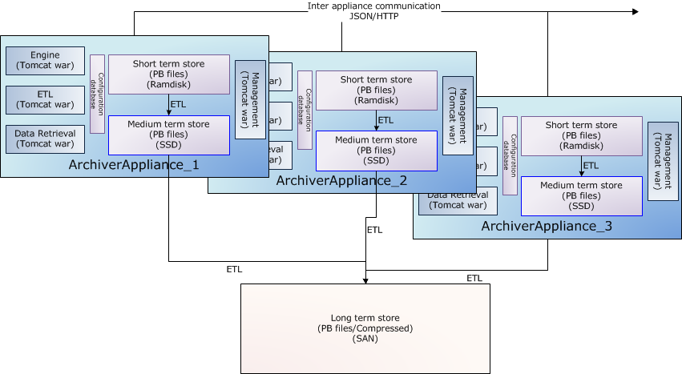
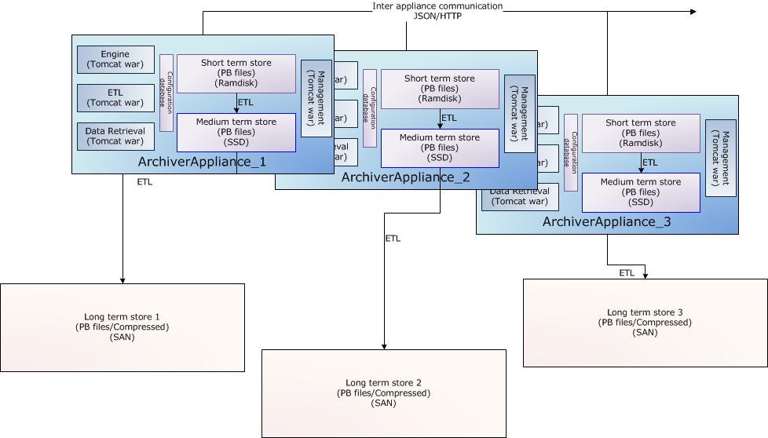
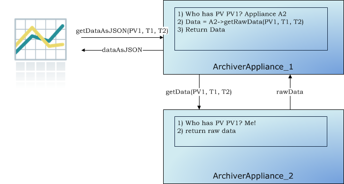

# Architecture

Each appliance consists of 4 modules deployed in Tomcat containers as
separate [WAR](http://en.wikipedia.org/wiki/WAR_file_format_%28Sun%29)
files. For production systems, it is recommended that each module be
deployed in a separate Tomcat instance (thus yielding four Tomcat
processes). A sample storage configuration is outlined below where we'd
use

1. Ramdisk for the short term store - in this storage stage, we'd
store data at a granularity of an hour.
2. SSD/SAS drives for the medium term store - in this storage stage,
we'd store data at a granularity of a day.
3. A NAS/SAN for the long term store - in this storage stage, we'd
store data at a granularity of a year.

A wide variety of such configurations is possible and supported. For
example, if you have a powerful enough NAS/SAN, you could write straight
to the long term store; bypassing all the stages in between.

The long term store is shown outside the appliance as an example of a
commonly deployed configuration. There is no necessity for the
appliances to share any storage; so both of these configurations are
possible.

## Clustering

While each appliance in a cluster is independent and self-contained, all
members of a cluster are listed in a special configuration file
(typically called [appliances.xml](https://epicsarchiver.readthedocs.io/en/latest/sysadmin/explanations/configuration.html))
that is site-specific and identical across all appliances in the
cluster. The `appliances.xml` is a simple XML file that contains the
ports and URLs of the various webapps in that appliance. Each appliance
has a dedicated TCP/IP endpoint called `cluster_inetport` for cluster
operations like cluster membership etc.. One startup, the `mgmt` webapp
uses the `cluster_inetport` of all the appliances in `appliances.xml` to
discover other members of the cluster. This is done using TCP/IP only
(no need for broadcast/multicast support).

The business processes are all cluster-aware; the bulk of the
inter-appliance communication that happens as part of normal operation
is accomplished using JSON/HTTP on the other URLs defined in
`appliances.xml`. All the JSON/HTTP calls from the mgmt webapp are also
available to you for use in
[scripting](https://epicsarchiver.readthedocs.io/en/latest/developer/guides/scripting.html).

The archiving functionality is split across members of the cluster; that
is, each PV that is being archived is being archived by one appliance in
the cluster. However, both data retrieval and business requests can be
dispatched to any random appliance in the cluster; the appliance has the
functionality to route/proxy the request accordingly.

In addition, users do not need to allocate PVs to appliances when
requesting for new PVs be archived. The appliances maintain a small set
of metrics during their operation and use this in addition to the
measured event and storage rates to do an automated Capacity Planning /
load balancing.

## Information useful to developers

1. If you are unfamiliar with servlet containers; here's a small overview
that a few collaborators found useful
- Reading up on a few basics will help; there are several good
	sources of information on the net; but don't get bogged down by
	the details.
- Please do use Eclipse/Netbeans/IntelliJ to navigate the code.
	This makes life so much easier.
- To get a quick sense of what a class/interface does, you can use
	the [javadoc](https://epicsarchiver.readthedocs.io/en/latest/_static/javadoc/index.html). Some attempts have been made to
	have some Javadoc in most classes and all interfaces
- We use Tomcat purely as a servlet container; that is, a quick
	way of servicing HTTP requests using Java code.
- A WAR file is basically a ZIP file (you can use unzip) with some
	conventions. For example, all the libraries (.jar's) that the
	application depends on will be located in the `WEB-INF/lib`
	folder.
- The starting point for servlets in a WAR file is the file
	`WEB-INF/web.xml`. For example, in the mgmt.war's
	`WEB-INF/web.xml`, you can see that all HTTP requests matching
	the pattern `/bpl/*` are satisfied using the Java class
	`org.epics.archiverappliance.mgmt.BPLServlet`.
- If you navigate to this class in Eclipse, you'll see that it is
	basically a registry of BPLActions.
- For example, the HTTP request, `/mgmt/bpl/getAllPVs` is
	satisfied using the `GetAllPVs` class. Breaking this down,
	1. `/mgmt` gets you into the mgmt.war file.
	2. `/bpl` gets you into the BPLServlet class.
	3. `/getAllPVs` gets you into the GetAllPVs class.
- From a very high level
	- The engine.war establishes Channel Access monitors and then
	writes the data into the short term store (STS).
	- The etl.war file moves data between stores - that is from
	the STS to the MTS and from the MTS to the LTS and so on.
	- The retrieval.war gathers data from all the stores, stitches
	them together to satisfy data retrieval requests.
	- The mgmt.war manages all the other three and holds
	configuration state.
- In terms of configuration, the most important is the
	`PVTypeInfo`; you can see what one looks like by looking at
	`http://machine:17665/mgmt/bpl/getPVTypeInfo?pv=MYPV:111:BDES`
- The main interfaces are the ones in the
	[`org.epics.archiverappliance`](https://epicsarchiver.readthedocs.io/en/latest/_static/javadoc/org/epics/archiverappliance/package-summary.html)
	package.
- The
	[ConfigService](https://epicsarchiver.readthedocs.io/en/latest/_static/javadoc/org/epics/archiverappliance/config/ConfigService.html)
	class does all configuration management.
- The [customization guide](https://epicsarchiver.readthedocs.io/en/latest/sysadmin/guides/customization.html) is also a good
	guide to the way in which this product can be customized.

## ConfigService

All of the configuration in the archiver appliance is handled thru
implementations of the
[ConfigService](https://epicsarchiver.readthedocs.io/en/latest/_static/javadoc/org/epics/archiverappliance/config/ConfigService.html)
interface. Each webapp has one instance of this interface and this
instance is dependency injected into the classes that need it. If all
else fails, you can create your implementation of the ConfigService and
register it in the servlet context
[listener](https://epicsarchiver.readthedocs.io/en/latest/_static/javadoc/org/epics/archiverappliance/config/ArchServletContextListener.html).
