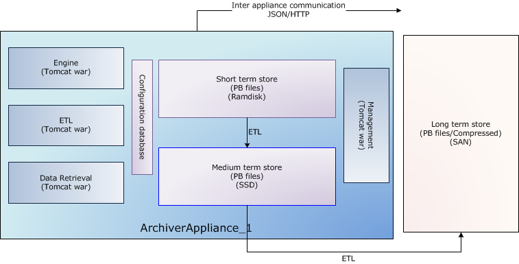

## Architecture

Each appliance consists of 4 modules deployed in Tomcat containers as
separate [WAR](http://en.wikipedia.org/wiki/WAR_file_format_%28Sun%29)
files. For production systems, it is recommended that each module be
deployed in a separate Tomcat instance (thus yielding four Tomcat
processes). A sample storage configuration is outlined below where we\'d
use

1. Ramdisk for the short term store - in this storage stage, we\'d
   store data at a granularity of an hour.
2. SSD/SAS drives for the medium term store - in this storage stage,
   we\'d store data at a granularity of a day.
3. A NAS/SAN for the long term store - in this storage stage, we\'d
   store data at a granularity of a year.



A wide variety of such configurations is possible and supported. For
example, if you have a powerful enough NAS/SAN, you could write straight
to the long term store; bypassing all the stages in between.

The long term store is shown outside the appliance as an example of a
commonly deployed configuration. There is no necessity for the
appliances to share any storage; so both of these configurations are
possible.

```{figure} ../../images/clusterinto1lts.png
:alt: Multiple appliances into one long term store

Multiple appliances sending data into one long term store
```

```{figure} ../../images/clusterintodifflts.png
:alt: Multiple appliances into different long term stores

Multiple appliances sending data into different long term
stores
```
