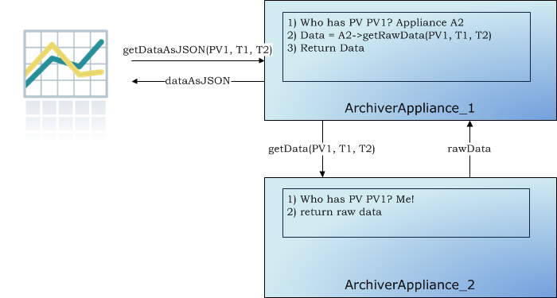

## Clustering

While each appliance in a cluster is independent and self-contained, all
members of a cluster are listed in a special configuration file
(typically called [appliances.xml](../sysadmin/installguide#appliances_xml))
that is site-specific and identical across all appliances in the
cluster. The `appliances.xml` is a simple XML file that contains the
ports and URLs of the various webapps in that appliance. Each appliance
has a dedicated TCP/IP endpoint called `cluster_inetport` for cluster
operations like cluster membership etc.. One startup, the `mgmt` webapp
uses the `cluster_inetport` of all the appliances in `appliances.xml` to
discover other members of the cluster. This is done using TCP/IP only
(no need for broadcast/multicast support).

The business processes are all cluster-aware; the bulk of the
inter-appliance communication that happens as part of normal operation
is accomplished using JSON/HTTP on the other URLs defined in
`appliances.xml`. All the JSON/HTTP calls from the mgmt webapp are also
available to you for use in scripting, see the section on
[scripting](#scripting).

The archiving functionality is split across members of the cluster; that
is, each PV that is being archived is being archived by one appliance in
the cluster. However, both data retrieval and business requests can be
dispatched to any random appliance in the cluster; the appliance has the
functionality to route/proxy the request accordingly.

In addition, users do not need to allocate PVs to appliances when
requesting for new PVs be archived. The appliances maintain a small set
of metrics during their operation and use this in addition to the
measured event and storage rates to do an automated [Capacity Planning](../_static/javadoc/org/epics/archiverappliance/mgmt/archivepv/CapacityPlanningBPL.html)/load
balancing.
