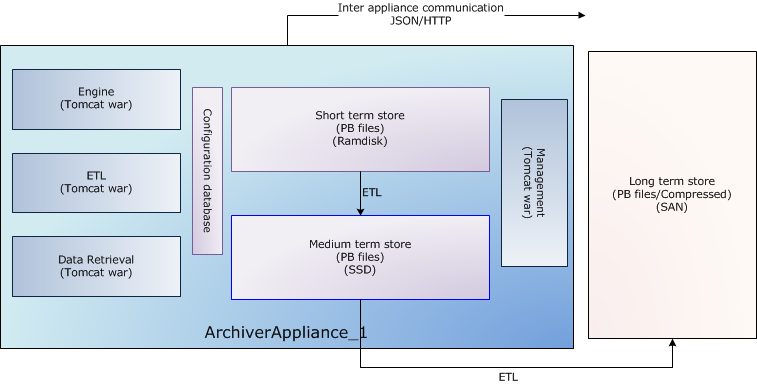
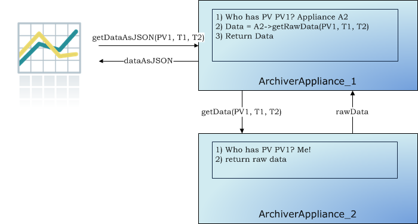
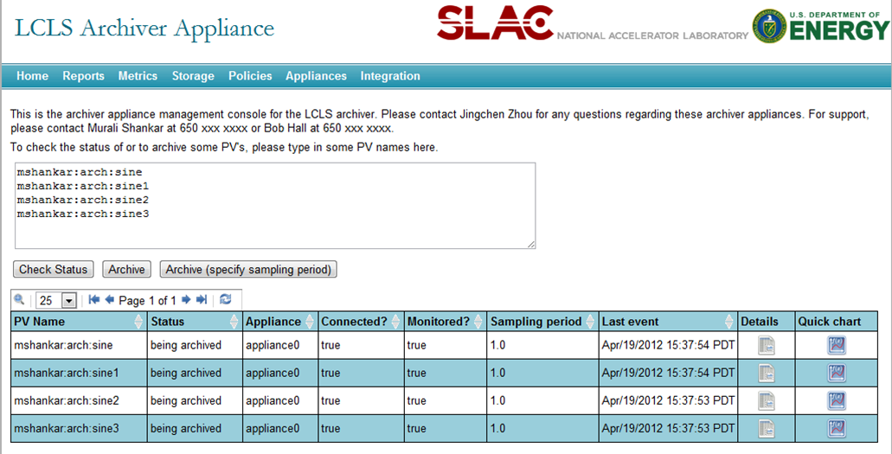
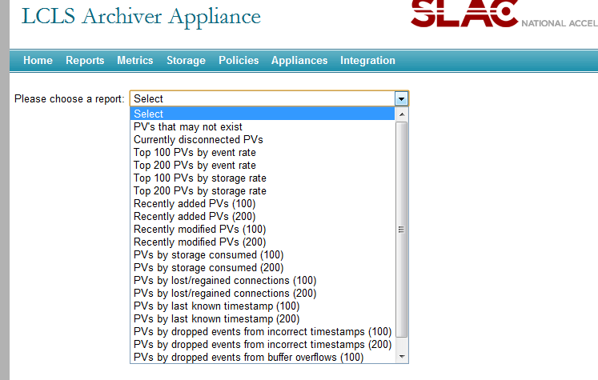
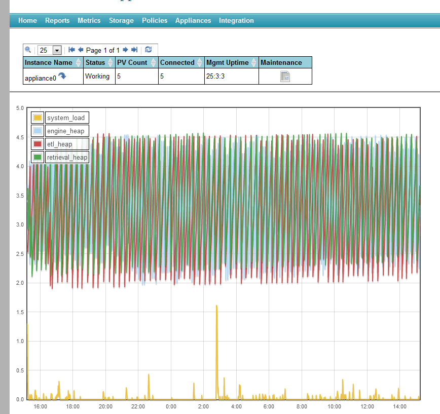

# Details

This is an implementation of an archiver for
[EPICS](http://www.aps.anl.gov/epics/index.php) control systems that
aims to archive millions of PVs.

Here are the main features.

- Ability to cluster appliances and to scale by adding appliances to
  the cluster.
  - Limited support for [redundancy](../sysadmin/redundancy).
  - Ability to dynamically [re-assign](../sysadmin/reassign) PVs to appliances.
- Multiple stages and an inbuilt process to move data between the
  stages.
  - This supports the ability to use faster storage (which is
    perhaps limited in size) to improve performance.
  - Ability to reduce (decimate) the data as it moves into a store.
- Focus on data retrieval performance.
- A management interface giving you the ability to manage and monitor
  the system using a browser. This includes
  1. The ability to add PVs to a cluster of appliances using a
     browser (perhaps by users).
  2. Various metrics to help with capacity planning.
  3. Ability to define system-wide defaults for archiving parameters
     using policies.
- Ability to script the business processes in the appliances using an
  external process in a language like
  [Python](http://www.python.org/).
- Ability to configure various archiving parameters on a per PV basis.
- Ability to customize the appliance to suit a different set of
  requirements. This includes
  - The ability to use alternate storage technologies that may
    better suit your needs or perform better in your environment.
  - The ability to define your own data reduction algorithms and to
    optionally cache data generated by these algorithms on a per PV
    basis.
  - Simple ways to add support for new MIME types in data retrieval
    responses.
- Support for EPICS aliases.
- Support for EPICS 7/PVAccess/Structured data.
- Support for retrieval of data using [CS-Studio](../user/cstudio), the
  [ArchiveViewer](../user/archiveviewer) and Matlab.
- Limited integration with existing Channel Archiver data sources.

## System requirements

These are the prerequisites for the EPICS archiver appliance.

- A recent version of Linux, definitely 64 bit Linux for production
  systems. If using RedHat, we should aim for RedHat 6.1.
- JDK 1.16+ - definitely the 64 bit version for production systems. We
  need the JDK, **not** the JRE.
- A recent version of Tomcat 11.x; preferably `apache-tomcat-11.0.12` or
  later.
- The management UI works best with a recent version of Firefox or
  Chrome.
- By default, the EPICS archiver appliance uses a bundled versions of
  the Java CA and PVA libraries from [EPICS
  base](https://github.com/epics-base/epicsCoreJava).

Optionally, we\'d need

- A recent version of MySQL `mysql-5.1` or later if persisting
  configuration to a database. We hope to add Postgres support soon.

In terms of hardware, for production systems, we\'d need a reasonably
powerful server box with lots of memory for each appliance. For example,
we use 24 core machines with 128GB of memory and 15K SAS drives for
medium term storage.

## Storage

Out of the box, the following storage technologies/plugins are
supported.

[PlainStoragePlugin](../_static/javadoc/edu/stanford/slac/archiverappliance/plain/PlainStoragePlugin.html){.external}
: This plugin serializes samples using Google\'s
[ProtocolBuffers](https://developers.google.com/protocol-buffers)
and stores data in chunks. Each chunk has a well defined key and
stores data for one PV for a well defined time duration (for
example, a month). Using Java
[NIO2](http://docs.oracle.com/javase/7/docs/api/java/nio/file/package-summary.html),
one can store each chunk in 1. A file per chunk resulting in a file per PV per time partition. 2. A zip file entry in a `.zip` file per chunk resulting in a
`.zip` file per PV. 3. This can be extended to use other storage technologies for which
a NIO2 provider is available (for example, [Amazon
S3](https://github.com/Upplication/Amazon-S3-FileSystem-NIO2), a
database BLOB per chunk or a key/value pair per chunk in any
key/value store).

    :::{note}
    By default, the PlainStoragePlugin maps PV names to keys using a
    simple algorithm that relies on the presence of a good PV naming
    convention. To use your own mapping scheme, see the [Key Mapping](../sysadmin/customization#key_mapping) section in the
    customization guide.
    :::

To add support for other storage technologies - see the [customization
guide](../sysadmin/customization) for details.

## Architecture

Each appliance consists of 4 modules deployed in Tomcat containers as
separate [WAR](http://en.wikipedia.org/wiki/WAR_file_format_%28Sun%29)
files. For production systems, it is recommended that each module be
deployed in a separate Tomcat instance (thus yielding four Tomcat
processes). A sample storage configuration is outlined below where we\'d
use

1. Ramdisk for the short term store - in this storage stage, we\'d
   store data at a granularity of an hour.
2. SSD/SAS drives for the medium term store - in this storage stage,
   we\'d store data at a granularity of a day.
3. A NAS/SAN for the long term store - in this storage stage, we\'d
   store data at a granularity of a year.



A wide variety of such configurations is possible and supported. For
example, if you have a powerful enough NAS/SAN, you could write straight
to the long term store; bypassing all the stages in between.

The long term store is shown outside the appliance as an example of a
commonly deployed configuration. There is no necessity for the
appliances to share any storage; so both of these configurations are
possible.

```{figure} ../images/clusterinto1lts.png
:alt: Multiple appliances into one long term store

Multiple appliances sending data into one long term store
```

```{figure} ../images/clusterintodifflts.png
:alt: Multiple appliances into different long term stores

Multiple appliances sending data into different long term
stores
```

## Policies

All of the various configurations can get quite tricky for end users to
navigate. Rather than expose all of this variation to the end users and
to provide a simple interface to end users, the archiver appliance uses
[policies](../_static/javadoc/org/epics/archiverappliance/mgmt/policy/package-summary.html){.external}.
Policies are Python scripts that make these decisions on behalf of the
users. Policies are site-specific and identical across all appliances in
the cluster. When a user requests a new PV to be archived, the archiver
appliance samples the PV to determine event rate, storage rate and other
parameters. In addition, various fields of the PV like .NAME, .ADEL,
.MDEL, .RTYP etc are also obtained. These are passed to the policies
python script which then has some simple code to configure the detailed
archival parameters. The archiver appliance executes the `policies.py`
python script using an embedded [jython](http://www.jython.org/)
interpreter. Policies allow system administrators to support a wide
variety of configurations that are more appropriate to their
infrastructure without exposing the details to their users.

## Clustering

While each appliance in a cluster is independent and self-contained, all
members of a cluster are listed in a special configuration file
(typically called [appliances.xml](../sysadmin/installguide#appliances_xml))
that is site-specific and identical across all appliances in the
cluster. The `appliances.xml` is a simple XML file that contains the
ports and URLs of the various webapps in that appliance. Each appliance
has a dedicated TCP/IP endpoint called `cluster_inetport` for cluster
operations like cluster membership etc.. One startup, the `mgmt` webapp
uses the `cluster_inetport` of all the appliances in `appliances.xml` to
discover other members of the cluster. This is done using TCP/IP only
(no need for broadcast/multicast support).

The business processes are all cluster-aware; the bulk of the
inter-appliance communication that happens as part of normal operation
is accomplished using JSON/HTTP on the other URLs defined in
`appliances.xml`. All the JSON/HTTP calls from the mgmt webapp are also
available to you for use in scripting, see the section on
[scripting](#scripting).

The archiving functionality is split across members of the cluster; that
is, each PV that is being archived is being archived by one appliance in
the cluster. However, both data retrieval and business requests can be
dispatched to any random appliance in the cluster; the appliance has the
functionality to route/proxy the request accordingly.



In addition, users do not need to allocate PVs to appliances when
requesting for new PVs be archived. The appliances maintain a small set
of metrics during their operation and use this in addition to the
measured event and storage rates to do an automated [Capacity Planning](../_static/javadoc/org/epics/archiverappliance/mgmt/archivepv/CapacityPlanningBPL.html)/load
balancing.

## Scripting

The archiver appliance comes with a web UI that has support for various
business processes like adding PV\'s to the archivers etc. The web UI
communicates with the server principally using JSON/HTTP web service
calls. The same web service calls are also available for use from
external scripting tools like Python.

```bash

#!/usr/bin/env python

import requests

resp = requests.get("http://archappl.slac.stanford.edu/mgmt/bpl/getAllPVs?pv=VPIO:IN20:111:VRA*")
print("\n".join(resp.json()))
```

Click [here](api/mgmt_scriptables.html) for a list of
business logic accessible thru scripting.

## EPICS 7

The archiver appliance has built in support for EPICS 7 and archiving
PV\'s over PVAccess. NTScalars and NTScalarArrays are stored as their
channel access counterparts. For example, `PVDouble`\'s will be stored
as `DBR_SCALAR_DOUBLE`\'s. This makes it possible to use standard
archive viewers to view NTScalars and NTScalarArrays archived thru
PVAccess. Other PVData types are stored as a bunch of bits using
PVAccess serialization. While this is probably not the most efficient,
it does allow for archiving of arbitrary structured data. There is
support for retrieving of structured data using the `RAW` and `JSON`
formats.

### Screenshots







