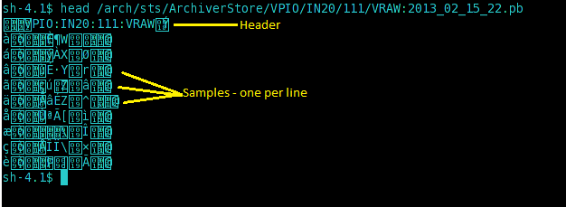

# The .pb file format and the .pbraw binary protocol

## The `.pb` file format

The
[PlainStoragePlugin](../_static/javadoc/edu/stanford/slac/archiverappliance/PlainPB/PlainStoragePlugin.html){.external}
in the EPICS archiver appliance uses Google\'s
[ProtocolBuffers](https://developers.google.com/protocol-buffers) as the
serialization mechanism. The PB definitions mapping EPICS DBR types to
PB messages can be found in [EPICSEvent.proto](../../../EPICSEvent.proto). PB
files contain serialized PB messages; one per sample; a sample per line.
The first line in a PB file is a header (`PayloadInfo` PB message) that
contains some basic information like the PV name, its DBR type and so
on.

As serialized PB messages are binary data; after serialization, newline
characters are escaped to maintain a \"sample per line\" constraint.

1. The ASCII escape character `0x1B` is escaped to the following two
   characters `0x1B 0x01`
2. The ASCII newline character `\n` or `0x0A` is escaped to the
   following two characters `0x1B 0x02`
3. The ASCII carriage return character `0x0D` is escaped to the
   following two characters `0x1B 0x03`

Because of the sample per line constraint, one can use `wc -l` to
determine the number of events in a PB file. The \"sample per line\"
constraint also lets us determine where a sample begins and ends at any
arbitrary location in the file.

PB files try to optimize on storage consumption. On an average, an
`EPICS DBR_DOUBLE/PB ScalarDouble` consumes about 21 bytes per sample.
To save space, the record processing timestamps in the samples are split
into three parts

1. **year** - This is stored once in the PB file in the header.
2. **secondsintoyear** - This is stored with each sample.
3. **nano** - This is stored with each sample.

This leads to the side-effect that each PB file \"belongs\" to a year.
In addition, the record processing timestamps are guaranteed to be and
expected to be monotonically increasing. The \"monotonically increasing
timestamps\" constraint lets us use various search algorithms on PB
files without the need for an index. The
[PlainStoragePlugin](../_static/javadoc/edu/stanford/slac/archiverappliance/PlainPB/PlainStoragePlugin.html)
handles the translation back and forth between DBR types and raw PB
messages and also enforces a strict partitioning.

The installation bundle also includes some utilities that manipulate PB
files. These can be found in the `install/pbutils` folder of the `mgmt`
webapp. These include

1. **printTimes.sh** - This utility prints the record processing
   timestamps of all the samples in the set of specified PB files.
2. **pb2json.sh** - This utility prints all the data in all the samples
   in the set of specified PB files as JSON that can potentially be
   loaded into Python or other languages.
3. **validate.sh** - This utility performs some simple validation of
   the set of specified PB files or PB files in the specified folders.
4. **repair.sh** - This utility performs some simple validation of the
   set of specified PB files or PB files in the specified folders. If
   errors are found in a PB file, the PB file is repaired by copying
   the valid samples into a new file and then renaming it to the old
   file name. It also support an option to make a backup of the
   original file before attempting to fix it.

## The PB/HTTP protocol

The `PB/HTTP` is a binary protocol over HTTP that is an extension of the
`.pb` file format. The main difference is that PB files contain only one
chunk (header+samples) while the PB/HTTP can contain many chunks. Chunks
are separated by empty lines (`\n` characters) similar to how HTTP
separates its headers from the body. While streaming data over the
PB/HTTP protocol, the server also uses [HTTP chunks](http://en.wikipedia.org/wiki/Chunked_transfer_encoding) to
transfer the data across. There is no strict formula on how many chunks
there will per data retrieval request; the server chunks data based on
data source/partition/other parameters. Both
[pbrawclient](https://github.com/slacmshankar/epicsarchiverap_pbrawclient/)
and [carchivetools](https://github.com/epicsdeb/carchivetools) handle
the multiple chunks in a seamless fashion and present the data to the
caller as a single event stream.

