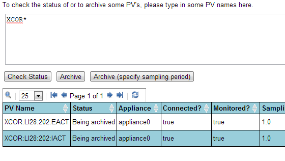

# Check the status of a PV

1. Enter any number of PV's in the text area (one per line) and click
   on the `Check Status` button
2. You can also enter
   [GLOB](http://en.wikipedia.org/wiki/Glob_%28programming%29)
   expressions like `XCOR*` and the archiver appliance will then
   display the status of all PV's that match the GLOB expression.
   

   Note that the number of matched PV's can be quite large; for now,
   no attempt is made to restrict the number of entries in this
   particular request. This may change in the future based on user
   feedback.
