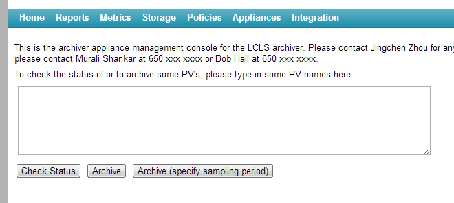

# Submit a PV for archiving

The EPICS Archiver Appliance offers a web UI for typical configuration
tasks. This UI works best with a recent version of Firefox or Chrome.

1. Go to the home page of the archiver appliance.
   
2. Enter any number of PV's in the text area (one per line) and click
   on the `Archive` button.
3. If you wish to specify the sampling period, then click on the
   `Archive (specify sampling period)` button instead.
4. When adding a new PV to the cluster, the archiver appliance measures
   various parameters about the PV. This takes about 4-5 minutes during
   which the PV is in an `Initial sampling` state.
5. Once the PV's characteristics have been measured, the appliance
   assigns the PV to an appliance in the cluster and the PV transitions
   to a `Being archived` state.
6. If the archiver appliance is not able to connect to a PV, the PV
   stays in the `Initial sampling` state until it is able to
   connect.
7. You can request a PV to be archived before it is available on the
   network. The request to archive the PV is stored in the persistent
   configuration until the archiver appliance can connect. Once the
   archiver appliance is able to connect to the PV, it continues on the
   normal workflow (where various parameters about the PV are measured
   etc).
8. Using `Archive (specify sampling period)`, you can additionally
   specify
   1. Archival method: Whether the archiver will use CA monitors/scan
      threads to sample at the specified sampling period.
   2. Conditional archiving PV: The archiving for this PV is performed
      only when the conditional archiving PV's `.VAL` field is
      non-zero.
   3. Policy: The archiver appliance uses policies set up the
      administrator to configure how the PV is to be archived. You can
      override this by choosing a policy yourself. This lets your
      system administrator set up a set of policies and lets the user
      choose manually from among those policies.
9. To add a PVAccess PV, use the `pva://` prefix. For example,
   `pva://BMAD:SYS:CU_HXR:DESIGN:TWISS` connects to the PV
   `BMAD:SYS:CU_HXR:DESIGN:TWISS` over PVAccess
