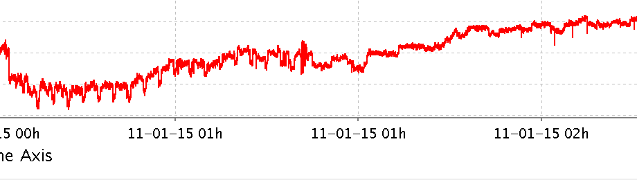

## Timezones

EPICS IOCs use UTC as their timezone. The EPICS Archiver Appliance
also uses UTC for data storage and retrieval — data is received, stored
and retrieved as UTC timestamps. Conversion to local time zones is done
at the client/viewer. The various viewers handle the transition into and
out of daylight savings appropriately. For example, there are two
`01:00` blocks on the x-axis when daylight savings ends at 01:00 on
Nov/1/2015 to represent the extra hour inserted.

