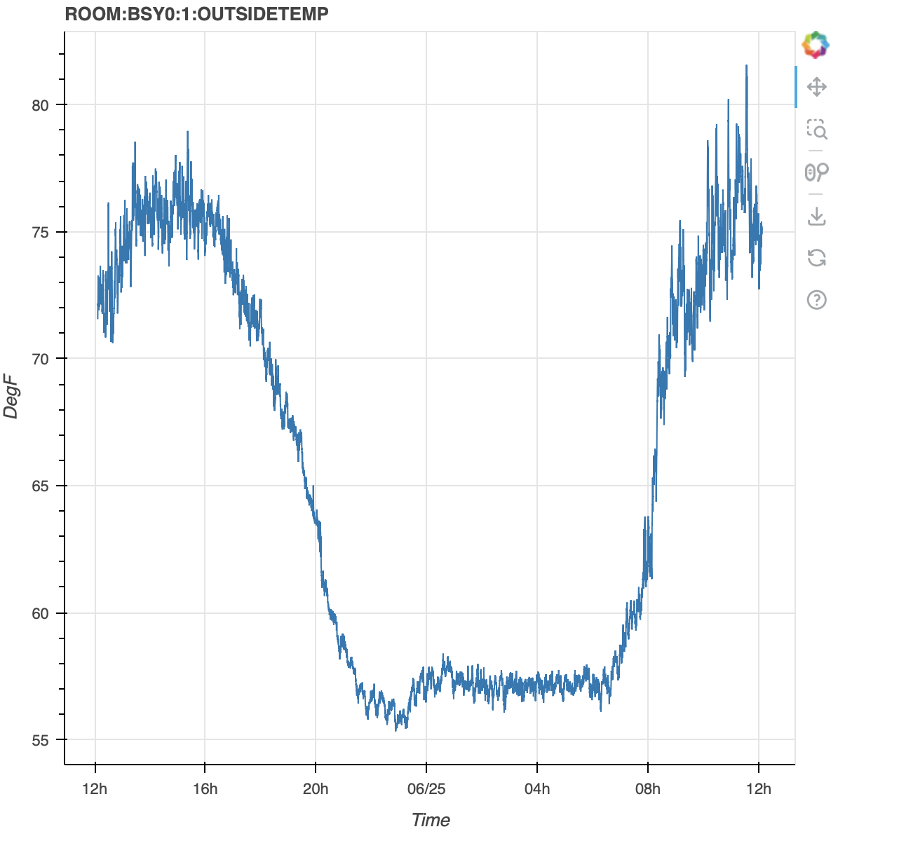

# Retrieving data using the web client

The EPICS Archiver Appliance supports data retrieval in multiple
formats/MIME types. These are some of the few formats supported today;
more can easily be added as needed.

1. [JSON](http://www.json.org/) - A generic JSON format that can be
   easily loaded into most browsers using Javascript.
2. CSV - Can be used for importing into Excel and other spreadsheets.
3. MAT - This is the file format used for interoperating with Matlab.
4. RAW - This is a binary format used by the Archive Viewer and is
   based on the [PB/HTTP](pb_pbraw.html) protocol.
5. TXT - A simple text format that is often helpful for debugging.
6. [SVG](http://www.w3.org/Graphics/SVG/) - A XML format that can also
   be used as a SVG element in tools that support this format.

For GUI clients such as CS-Studio, Archive Viewer, and Matlab, see their
respective how-to guides: [CS-Studio](./cstudio),
[Archive Viewer](./archiveviewer), [Matlab](./matlab).

## Constructing a data retrieval URL

Getting data into a tool necessitates construction of a data retrieval
URL as the first step. A data retrieval URL looks something like so

<http://archiver.slac.stanford.edu/retrieval/data/getData.json?pv=VPIO%3AIN20%3A111%3AVRAW&from=2012-09-27T08%3A00%3A00.000Z&to=2012-09-28T08%3A00%3A00.000Z>

where

1. `http://archiver.slac.stanford.edu/retrieval` is the
   `data_retrieval_url` element from your `appliances.xml`
2. `/data/getData` is the path into the data retrieval servlet and is
   fixed.
3. `.json` identifies the MIME-type of the returned data.
4. The remainder consists of parameters (all of which need to be [URL
   encoded](http://en.wikipedia.org/wiki/Percent-encoding) for
   correctness)
   1. `pv` - This identifies the name of the PV for which data is
      requested.
   2. `from` - This is the start time of the data in [ISO
      8601](http://en.wikipedia.org/wiki/ISO_8601) format;
      specifically
      [this](<http://joda-time.sourceforge.net/apidocs/org/joda/time/format/ISODateTimeFormat.html#dateTime()>)
      format.
   3. `to` - This is the end time of the data in the same format.
   4. Optional parameters
      - `fetchLatestMetadata` - If _true_, an extra call is made to
        the engine as part of the retrieval to get the latest values
        of the various fields _(DESC, HIHI etc)_.
      - `retiredPVTemplate` - If specified, the archiving
        information (PVTypeInfo) for the PV specified in this
        parameter is used as a template for PVs that do not exist in
        the system. This is intended principally for use with legacy
        PVs (PVs that no longer exist on the LAN and do not have a
        PVTypeInfo).
        1. For example, all the data for legacy PV's could be
           consolidated into yearly partitions and stored on tape.
        2. When a user places a request for this data, it could be
           restored to some standard folder, for example
           _/arch/tape_.
        3. A template PV (probably paused), for example,
           `TEMPLATE:PV` is added to the system with one of its
           stores pointing to _/arch/tape_.
        4. For all data retrieval requests, this template PV is
           specified as the value of the `retiredPVTemplate`
           argument. For example,
           _<http://archiver.slac.stanford.edu/retrieval/data/getData.json?_`pv=LEGACY:PV`_&from=2012-09-27T08%3A00%3A00.000Z&to=2012-09-28T08%3A00%3A00.000Z_&`retiredPVTemplate=TEMPLATE:PV`>.
        5. Because the archiver does not find a PVTypeInfo for
           `LEGACY:PV`, it uses the PVTypeInfo for `TEMPLATE:PV` to
           determine data stores for the `LEGACY:PV`.
        6. The data in _/arch/tape_ is used to fulfill the data
           retrieval request.
        7. Once the user is done with the data for `LEGACY:PV`, the
           data in _/arch/tape_ can be deleted.
      - `timeranges` - Get data for a sequence of time ranges. Time
        ranges are specified as a comma-separated list if ISO 8601
        strings.
      - `donotchunk` - Use this to skip HTTP chunking of the
        response. This is meant for client that do not understand
        chunked responses.
      - `ca_count` - This is passed on to an external
        ChannelArchiver as the value of the _count_ parameter in the
        _archiver.values_ XMLRPC call. The limits the number of
        samples returned from the ChannelArchiver; id unspecified,
        this defaults to 100000. If this is too large, you may
        timeouts from the ChannelArchiver.
      - `ca_how` - This is passed on to an external ChannelArchiver
        as the value of the _how_ parameter in the _archiver.values_
        XMLRPC call. This defaults to 0; that is, by default, we ask
        for raw data.

## Response format

The response typically contains

1. `seconds` - This is the Java epoch seconds of the EPICS record
   processing timestamp. The times are in UTC; so any conversion to
   local time needs to happen at the client.
2. `nanos` - This is the nano second value of the EPICS record
   processing timestamp.
3. Other elements - This set includes the value, status, severity and
   many other optional fields stored by the appliance.

Here's an example of loading data into Python in a Jupyter notebook and using Bokeh to display the data

```python
from datetime import datetime, timedelta
import pytz
import json

import requests
from bokeh.plotting import figure, show
from bokeh.io import output_notebook

utc = pytz.utc
tz = pytz.timezone('America/Los_Angeles')
end = datetime.now().astimezone(utc)
start = end - timedelta(days=1)
pvName = "ROOM:BSY0:1:OUTSIDETEMP"

resp = requests.get("http://archappl.epics-controls.org/retrieval/data/getData.json",
        params={
            "pv": pvName,
            "from": start.strftime('%Y-%m-%dT%H:%M:%S.%fZ'),
            "to": end.strftime('%Y-%m-%dT%H:%M:%S.%fZ'),
        })
resp.raise_for_status()
samples = resp.json()[0]["data"]
egu = resp.json()[0].get("meta", {}).get("EGU", "")
xpoints = [datetime.fromtimestamp(x["secs"]).astimezone(tz) for x in samples]
ypoints = [x["val"] for x in samples]

output_notebook()

fig = figure(title=pvName, x_axis_label='Time', x_axis_type='datetime', y_axis_label=egu)
fig.line(xpoints, ypoints)
show(fig)
```


