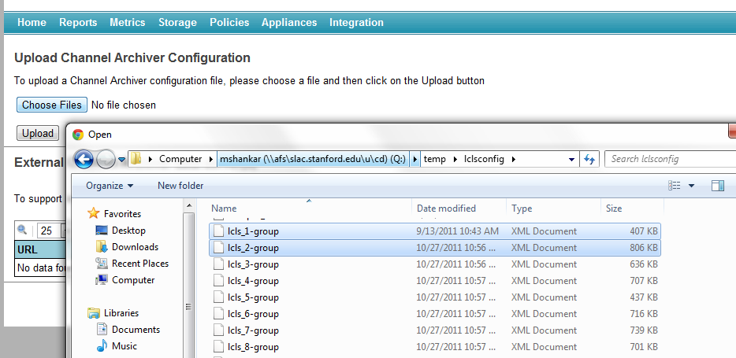

# Channel Archiver integration

The EPICS Archiver Appliance supports limited integration with existing
Channel Archiver installations.

- To import ChannelArchiver `XML` configuration files, click on the
  `Choose Files` button, select any number of ChannelArchiver `XML`
  configuration files and press `Upload`.
  

  The `DTD` for the ChannelArchiver `XML` file can be found in the
  ChannelArchiver documentation or in the ChannelArchiver source
  distribution.

- To proxy data from existing ChannelArchiver `XML-RPC` data servers,
  add the URL to the `XML-RPC` data server using the `Add` button. The
  EPICS Archiver Appliance uses the `archiver.names` method to
  determine the PVs that are hosted by the ChannelArchiver `XML-RPC`
  data server and adds this server as a data source for these PVs.
