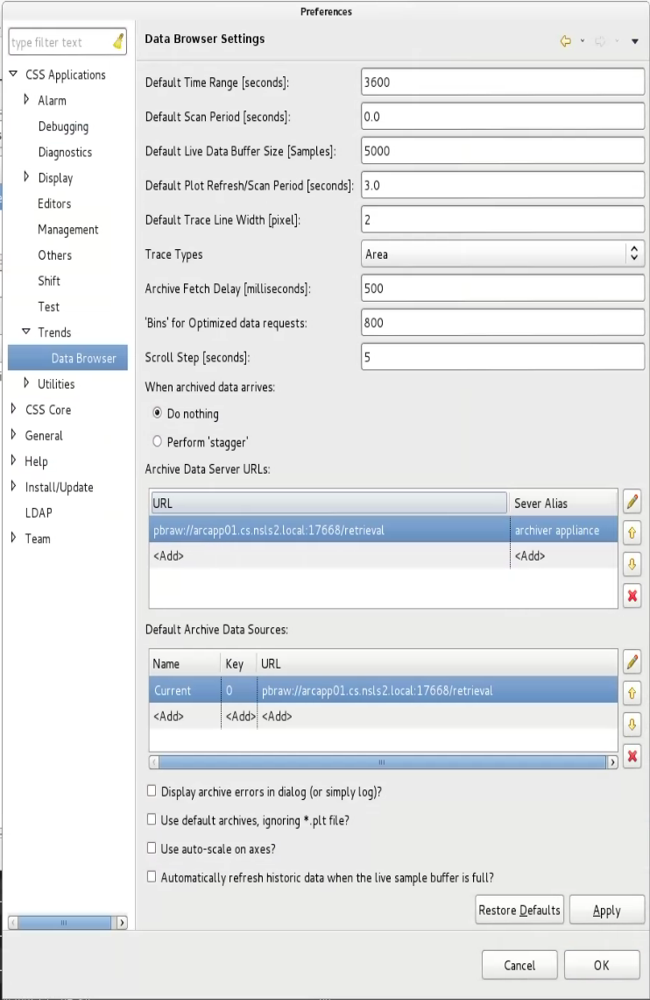

# CS Studio Integration

[CS-Studio](http://controlsystemstudio.org/) 4.X onwards comes with
support for the EPICS Archiver Appliance as a data source for the
databrowser.

## Configuring CS-Studio

CS-Studio communicates with the appliance using the
[PB/HTTP](../developer/pb_pbraw) protocol. The databrowser can be configured to
use the appliance by including the client retrieval URL to the list of
Archive data servers. From the top menu select
`Edit` > ` Preferences ` > ` CSS Applications ` > `Trends`

- Add the archiver appliance URL to the set of Archive Data Server
    URL\'s
  - This URL is generated by replacing the string *http* with the
        string *pbraw* in the `data_retrieval_url` element of your
        `appliances.xml` and looks like so
        `pbraw://archiver.slac.stanford.edu/retrieval`.

Example:

Once the URL has been added to the preferences, the archiver appliance
can be used in the databrowser like any other data source. Users can
search the archive for PV's, retrieve data and plot it, etc.

