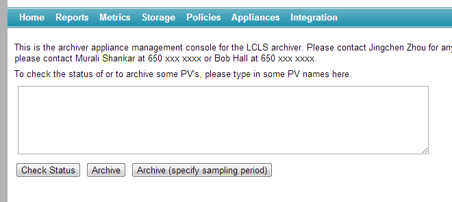
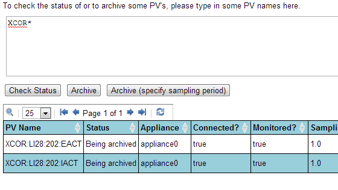
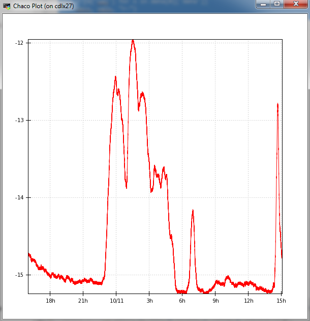

# User guide

The EPICS Archiver Appliance offers a web UI for typical configuration
tasks. This UI works best with a recent version of Firefox or Chrome.

## Adding a PV to be archived

To add a PV to the archiver,

1. Go to the home page of the archiver appliance.
   
2. Enter any number of PV\'s in the text area (one per line) and click
   on the `Archive` button.
3. If you wish to specify the sampling period, then click on the
   `Archive (specify sampling period)` button instead.
4. When adding a new PV to the cluster, the archiver appliance measures
   various parameters about the PV. This takes about 4-5 minutes during
   which the PV is in an `Initial sampling`{.sample} state.
5. Once the PV\'s characteristics have been measured, the appliance
   assigns the PV to an appliance in the cluster and the PV transitions
   to a `Being archived`{.sample} state.
6. If the archiver appliance is not able to connect to a PV, the PV
   stays in the `Initial sampling`{.sample} state until it is able to
   connect.
7. You an request a PV to be archived before it is available on the
   network. The request to archive the PV is stored in the persistent
   configuration until the archiver appliance can connect. Once the
   archiver appliance is able to connect to the PV, it continues on the
   normal workflow (where various parameters about the PV are measured
   etc).
8. Using `Archive (specify sampling period)`, you can additionally
   specify
   1. Archival method: Whether the archiver will use CA monitors/scan
      threads to sample at the specified sampling period.
   2. Conditional archiving PV: The archiving for this PV is performed
      only when the conditional archiving PV\'s `.VAL` field is
      non-zero.
   3. Policy: The archiver appliance uses policies set up the
      administrator to configure how the PV is to be archived. You can
      override this by choosing a policy yourself. This lets your
      system administrator set up a set of policies and lets the user
      choose manually from among those policies.
9. To add a PVAccess PV, use the `pva://` prefix. For example,
   `pva://BMAD:SYS:CU_HXR:DESIGN:TWISS` connects to the PV
   `BMAD:SYS:CU_HXR:DESIGN:TWISS` over PVAccess

To check the status of a PV.

1. Enter any number of PV\'s in the text area (one per line) and click
   on the `Check Status` button
2. You can also enter
   [GLOB](http://en.wikipedia.org/wiki/Glob_%28programming%29)
   expressions like `XCOR*` and the archiver appliance will then
   display the status of all PV\'s that match the GLOB expression.
   

   Note that the number of matched PV\'s can be quite large; for now,
   no attempt is made to restrict the number of entries in this
   particular request. This may change in the future based on user
   feedback.

## Retrieving data using CS-Studio, Archive Viewer and Matlab

1. To retrieve data using the CS-Studio, see the
   [CS-Studio](./csstudio) section.
2. To retrieve data using the Archive Viewer, see the [Archive Viewer](./archiveviewer) section.
3. To retrieve data using Matlab, see the [Matlab](./matlab)
   section.

## Retrieving data using other tools

The EPICS Archiver Appliance supports data retrieval in multiple
formats/MIME types. These are some of the few formats supported today;
more can easily be added as needed.

1. [JSON](http://www.json.org/) - A generic JSON format that can be
   easily loaded into most browsers using Javascript.
2. CSV - Can be used for importing into Excel and other spreadsheets.
3. MAT - This is the file format used for interoperating with Matlab.
4. RAW - This is a binary format used by the Archive Viewer and is
   based on the [PB/HTTP](pb_pbraw.html) protocol.
5. TXT - A simple text format that is often helpful for debugging.
6. [SVG](http://www.w3.org/Graphics/SVG/) - A XML format that can also
   be used as a SVG element in tools that support this format.

In general, getting data into a tool necessitates construction of a data
retrieval URL as the first step. A data retrieval URL looks something
like so

<http://archiver.slac.stanford.edu/retrieval/data/getData.json?pv=VPIO%3AIN20%3A111%3AVRAW&from=2012-09-27T08%3A00%3A00.000Z&to=2012-09-28T08%3A00%3A00.000Z>

where

1. `http://archiver.slac.stanford.edu/retrieval` is the
   `data_retrieval_url` element from your `appliances.xml`
2. `/data/getData` is the path into the data retrieval servlet and is
   fixed.
3. `.json` identifies the MIME-type of the returned data.
4. The remainder consists of parameters (all of which need to be [URL
   encoded](http://en.wikipedia.org/wiki/Percent-encoding) for
   correctness)
   1. `pv` - This identifies the name of the PV for which data is
      requested.
   2. `from` - This is the start time of the data in [ISO
      8601](http://en.wikipedia.org/wiki/ISO_8601) format;
      specifically
      [this](<http://joda-time.sourceforge.net/apidocs/org/joda/time/format/ISODateTimeFormat.html#dateTime()>)
      format.
   3. `to` - This is the end time of the data in the same format.
   4. Optional parameters
      - `fetchLatestMetadata` - If _true_, an extra call is made to
        the engine as part of the retrieval to get the latest values
        of the various fields _(DESC, HIHI etc)_.
      - `retiredPVTemplate` - If specified, the archiving
        information (PVTypeInfo) for the PV specified in this
        parameter is used as a template for PVs that do not exist in
        the system. This is intended principally for use with legacy
        PVs (PVs that no longer exist on the LAN and do not have a
        PVTypeInfo).
        1. For example, all the data for legacy PV\'s could be
           consolidated into yearly partitions and stored on tape.
        2. When a user places a request for this data, it could be
           restored to some standard folder, for example
           _/arch/tape_.
        3. A template PV (probably paused), for example,
           `TEMPLATE:PV` is added to the system with one of its
           stores pointing to _/arch/tape_.
        4. For all data retrieval requests, this template PV is
           specified as the value of the `retiredPVTemplate`
           argument. For example,
           _<http://archiver.slac.stanford.edu/retrieval/data/getData.json?_`pv=LEGACY:PV`_&from=2012-09-27T08%3A00%3A00.000Z&to=2012-09-28T08%3A00%3A00.000Z_&`retiredPVTemplate=TEMPLATE:PV`>.
        5. Because the archiver does not find a PVTypeInfo for
           `LEGACY:PV`, it uses the PVTypeInfo for `TEMPLATE:PV` to
           determine data stores for the `LEGACY:PV`.
        6. The data in _/arch/tape_ is used to fulfill the data
           retrieval request.
        7. Once the user is done with the data for `LEGACY:PV`, the
           data in _/arch/tape_ can be deleted.
      - `timeranges` - Get data for a sequence of time ranges. Time
        ranges are specified as a comma-separated list if ISO 8601
        strings.
      - `donotchunk` - Use this to skip HTTP chunking of the
        response. This is meant for client that do not understand
        chunked responses.
      - `ca_count` - This is passed on to an external
        ChannelArchiver as the value of the _count_ parameter in the
        _archiver.values_ XMLRPC call. The limits the number of
        samples returned from the ChannelArchiver; id unspecified,
        this defaults to 100000. If this is too large, you may
        timeouts from the ChannelArchiver.
      - `ca_how` - This is passed on to an external ChannelArchiver
        as the value of the _how_ parameter in the _archiver.values_
        XMLRPC call. This defaults to 0; that is, by default, we ask
        for raw data.

The response typically contains

1. `seconds` - This is the Java epoch seconds of the EPICS record
   processing timestamp. The times are in UTC; so any conversion to
   local time needs to happen at the client.
2. `nanos` - This is the nano second value of the EPICS record
   processing timestamp.
3. Other elements - This set includes the value, status, severity and
   many other optional fields stored by the appliance.

Here\'s an example of loading data into Python using JSON and then using
Chaco to render a plot.

```python
import numpy as np
from chaco.shell import *
import urllib2
import json

req = urllib2.urlopen("http://archiver.slac.stanford.edu/retrieval/data/getData.json?pv=test%3Apv%3A123&donotchunk")
data = json.load(req)
secs = [x['secs'] for x in data[0]['data']]
vals = [x['val'] for x in data[0]['data']]
plot(secs, vals, "r-")
xscale('time')
show()
```



## Processing of data

The EPICS archiver appliance has limited support for performing some
processing on the data during data retrieval. For most scientific data
processing purposes, a tool such as Matlab is a much better fit. To
retrieve data within Matlab, please see the [Matlab](./matlab)
section.

To process the data during data retrieval, specify the operator during
the call to `getData`. For example, to get the `mean` of the PV
`test:pv:123`, ask for
`http://archiver.slac.stanford.edu/retrieval/data/getData.json?pv=mean(test%3Apv%3A123)`.
This mechanism should work within the ArchiveViewer as well. That is, if
you plot `mean(test:pv:123)` in the ArchiveViewer, the EPICS archiver
appliance applies the `mean` operator to the data for PV `test:pv:123`
before returning it to the client. To plot `test:pv:123` with the
`mean_3600` operator in the ArchiveViewer, plot
`mean_3600(test:pv:123)`.

The EPICS archiver appliance uses [Apache Commons Math](http://commons.apache.org/proper/commons-math/) for its data
processing. Many operators bin the data into bins whose sizes are
specified as part of the operator itself. For example, the `mean_3600`
operator bins the data into bins that are 3600 seconds wide. The default
binning interval is 900 seconds (15 minutes). The binning is done using
the [integer division](http://en.wikipedia.org/wiki/Euclidean_division)
operator. Two samples belong to the same bin if the quotient of the
sample\'s epoch seconds after integer division by the binning interval
is the same. For example, in the case of `mean_3600`, two samples `S1`
and `S2` belong to the same bin if
`S1.epochSeconds/3600 = S2.epochSeconds/3600` where `/` represents the
quotient after integer division. Samples belonging to the same bin are
gathered together and sent thru various statistics operators.

firstSample
: Returns the first sample in a bin. This is the default sparsification operator.

lastSample
: Returns the last sample in a bin.

firstFill
: Similar to the firstSample operator with the exception that we alter the timestamp to the middle of the bin and copy over the previous bin\'s value if a bin does not have any samples.

lastFill  
 : Similar to the firstFill operator with the exception that we use the last sample in the bin.

mean
: Returns the average value of a bin. This is computed using [SummaryStatistics](http://commons.apache.org/proper/commons-math/javadocs/api-3.0/org/apache/commons/math3/stat/descriptive/SummaryStatistics.html) and is [SummaryStatistics.getMean()](<http://commons.apache.org/proper/commons-math/javadocs/api-3.0/org/apache/commons/math3/stat/descriptive/SummaryStatistics.html#getMean()>)

min
: Returns the minimum value in a bin. This is computed using [SummaryStatistics](http://commons.apache.org/proper/commons-math/javadocs/api-3.0/org/apache/commons/math3/stat/descriptive/SummaryStatistics.html) and is [SummaryStatistics.getMin()](<http://commons.apache.org/proper/commons-math/javadocs/api-3.0/org/apache/commons/math3/stat/descriptive/SummaryStatistics.html#getMin()>)

max
: Returns the maximum value in a bin. This is computed using [SummaryStatistics](http://commons.apache.org/proper/commons-math/javadocs/api-3.0/org/apache/commons/math3/stat/descriptive/SummaryStatistics.html) and is [SummaryStatistics.getMax()](<http://commons.apache.org/proper/commons-math/javadocs/api-3.0/org/apache/commons/math3/stat/descriptive/SummaryStatistics.html#getMax()>)

count
: Returns the number of samples in a bin. This is computed using [SummaryStatistics](http://commons.apache.org/proper/commons-math/javadocs/api-3.0/org/apache/commons/math3/stat/descriptive/SummaryStatistics.html) and is [SummaryStatistics.getN()](<http://commons.apache.org/proper/commons-math/javadocs/api-3.0/org/apache/commons/math3/stat/descriptive/SummaryStatistics.html#getN()>)

ncount
: Returns the total number of samples in a selected time span.

nth
: Returns every n-th value..

median
: Returns the median value of a bin. This is computed using [DescriptiveStatistics](http://commons.apache.org/proper/commons-math/apidocs/org/apache/commons/math3/stat/descriptive/DescriptiveStatistics.html) and is [DescriptiveStatistics.getPercentile(50)](<http://commons.apache.org/proper/commons-math/apidocs/org/apache/commons/math3/stat/descriptive/DescriptiveStatistics.html#getPercentile(double)>)

std
: Returns the standard deviation of a bin. This is computed using [SummaryStatistics](http://commons.apache.org/proper/commons-math/javadocs/api-3.0/org/apache/commons/math3/stat/descriptive/SummaryStatistics.html) and is [SummaryStatistics.getStandardDeviation()](<http://commons.apache.org/proper/commons-math/javadocs/api-3.0/org/apache/commons/math3/stat/descriptive/SummaryStatistics.html#getStandardDeviation()>)

jitter
: Returns the jitter (the standard deviation divided by the mean) of a bin. This is computed using [SummaryStatistics](http://commons.apache.org/proper/commons-math/javadocs/api-3.0/org/apache/commons/math3/stat/descriptive/SummaryStatistics.html) and is [SummaryStatistics.getStandardDeviation()](<http://commons.apache.org/proper/commons-math/javadocs/api-3.0/org/apache/commons/math3/stat/descriptive/SummaryStatistics.html#getStandardDeviation()>)/[SummaryStatistics.getMean()](<http://commons.apache.org/proper/commons-math/javadocs/api-3.0/org/apache/commons/math3/stat/descriptive/SummaryStatistics.html#getMean()>)

ignoreflyers
: Ignores data that is more than the specified amount of std deviation from the mean in the bin. This is computed using [SummaryStatistics](http://commons.apache.org/proper/commons-math/javadocs/api-3.0/org/apache/commons/math3/stat/descriptive/SummaryStatistics.html). It takes two arguments, the binning interval and the number of standard deviations (by default, 3.0). It filters the data and returns only those values which satisfy `Math.abs(val - SummaryStatistics.getMean()) <= numDeviations*SummaryStatistics.getStandardDeviation()`

flyers
: Opposite of ignoreflyers - only returns data that is more than the specified amount of std deviation from the mean in the bin.

variance
: Returns the variance of a bin. This is computed using [SummaryStatistics](http://commons.apache.org/proper/commons-math/javadocs/api-3.0/org/apache/commons/math3/stat/descriptive/SummaryStatistics.html) and is [SummaryStatistics.getVariance()](<http://commons.apache.org/proper/commons-math/javadocs/api-3.0/org/apache/commons/math3/stat/descriptive/SummaryStatistics.html#getVariance()>)

popvariance
: Returns the population variance of a bin. This is computed using [SummaryStatistics](http://commons.apache.org/proper/commons-math/javadocs/api-3.0/org/apache/commons/math3/stat/descriptive/SummaryStatistics.html) and is [SummaryStatistics.getPopulationVariance()](<http://commons.apache.org/proper/commons-math/javadocs/api-3.0/org/apache/commons/math3/stat/descriptive/SummaryStatistics.html#getPopulationVariance()>)

kurtosis
: Returns the kurtosis of a bin - Kurtosis is a measure of the peakedness. This is computed using [DescriptiveStatistics](http://commons.apache.org/proper/commons-math/apidocs/org/apache/commons/math3/stat/descriptive/DescriptiveStatistics.html) and is [DescriptiveStatistics.getKurtosis()](<http://commons.apache.org/proper/commons-math/apidocs/org/apache/commons/math3/stat/descriptive/DescriptiveStatistics.html#getKurtosis()>)

skewness
: Returns the skewness of a bin - Skewness is a measure of the asymmetry. This is computed using [DescriptiveStatistics](http://commons.apache.org/proper/commons-math/apidocs/org/apache/commons/math3/stat/descriptive/DescriptiveStatistics.html) and is [DescriptiveStatistics.getSkewness()](<http://commons.apache.org/proper/commons-math/apidocs/org/apache/commons/math3/stat/descriptive/DescriptiveStatistics.html#getSkewness()>)

## Save/Restore API

The EPICS Archiver Appliance has a separate API targeted at getting the
value of several PV\'s as of a point in time. This is primarily aimed at
save/restore applications where the archiver is often used as quality
control. To get data for multiple PV\'s as of a point in time, `POST` a
JSON list of PV names to
`http://archiver.slac.stanford.edu/retrieval/data/getDataAtTime?at=2018-10-19T15:22:37.000-07:00amp;includeProxies=true`
where

1. `at` - This specifies the point in time in ISO8601 format.
2. `includeProxies` - Optional; set this to true if you want to fetch
   data from external archiver appliances as part of this call. This
   defaults to false, so, by default, we do not proxy external
   appliances for this API call. As of now, we also do not support
   Channel Archiver integration for this API call.

The response is a JSON dict of dicts with the name of the PV as the key.
For example, here\'s a call asking for the value of a few PV\'s as of
`2018-10-22T10:40:00.000-07:00`

```bash
    $ curl -H "Content-Type: application/json"  -XPOST -s "http://localhost:17665/retrieval/data/getDataAtTime?at=2018-10-22T10:40:00.000-07:00&includeProxies=true" -d '["VPIO:IN20:111:VRAW", "ROOM:LI30:1:OUTSIDE_TEMP", "YAGS:UND1:1005:Y_BM_CTR", "A_nonexistent_pv" ]'
    {
        "ROOM:LI30:1:OUTSIDE_TEMP": {
            "nanos": 823158037,
            "secs": 1540229999,
            "severity": 0,
            "status": 0,
            "val": 60.358551025390625
        },
        "VPIO:IN20:111:VRAW": {
            "nanos": 754373158,
            "secs": 1540229999,
            "severity": 0,
            "status": 0,
            "val": 5.529228687286377
        },
        "YAGS:UND1:1005:Y_BM_CTR": {
            "nanos": 164648807,
            "secs": 1537710595,
            "severity": 0,
            "status": 0,
            "val": 0.008066000000000002
        }
    }
```

## Reports

The EPICS Archiver Appliance supports a wide variety of reports based on
static and dynamic information. These reports can also be accessed from
within scripting languages like python and can be used to facilitate
automation and integration. Some reports that are currently available
are

- **PV\'s that may not exist** - This report lists all the
  PVs in the cluster that have never connected. PVs whose names have
  typos in them would be included in this report.
- **Currently disconnected PVs** - This report lists all
  the PVs in the cluster that have connected in the past but are
  currently disconnected; perhaps because their IOCs have been turned
  off.
- **Top PVs by event rate** - These reports contain the PVs
  sorted by their actual event rate (descending).
- **Top PVs by storage rate** - These reports contain the
  PVs sorted by their actual storage rate (descending).
- **Recently added PVs** - These reports contain the PVs
  sorted by the creation timestamp of their PVTypeInfos (descending).
  PVs that were recently added show up first.
- **Recently modified PVs** - These reports contain the PVs
  sorted by the modification timestamp of their PVTypeInfos
  (descending). PVs that were recently modified show up first.
- **PVs by lost/regained connections** - These reports
  contain the PVs sorted by the number of times we\'ve
  lost/re-established the CA connection. This can be used to determine
  if an IOC is being overwhelmed (perhaps by all the archiving
  targeted at it).
- **PVs by last known timestamp** - These reports contain
  the PVs sorted by the timestamp of the last event received.
- **PVs by dropped events from incorrect timestamps** - The
  EPICS archiver appliance discards events that have invalid
  timestamps. These reports contain the PVs sorted by the number of
  events dropped because they had invalid timestamps. Events are
  dropped in these conditions.
  1. If the record processing timestamp from the IOC is before the
     PAST_CUTOFF_TIMESTAMP. PAST_CUTOFF_TIMESTAMP defaults to
     `1991-01-01T00:00:00.000Z`
  2. If the record processing timestamp from the IOC is after
     (Appliance Current Time + FUTURE_CUTOFF_SECONDS) in the future.
     FUTURE_CUTOFF_SECONDS defaults to 30\*60.
  3. If the record processing timestamp from the IOC is before the
     timestamp of the previous sample.
  4. If the record processing timestamp from the IOC is identical to
     the timestamp of the previous sample.
- **PVs by dropped events from buffer overflows** - The
  EPICS archiver appliance discards events when the sampling buffers
  (as estimated from the sampling period) become full. These reports
  contain the PVs sorted by the number of events dropped because the
  sampling buffers were full.

## Metrics

The EPICS Archiver Appliance maintains a wide variety of metrics to
facilitate in capacity planning and load balancing. These metrics can be
viewed in the Metrics page; a small subset of these metrics can be
viewed across the cluster. To view more details about the metrics on a
particular appliance, click on that appliance in the list view.

## Storage

The EPICS Archiver Appliance supports multiple stages for storing data
and allows for configuration of data stores on a per PV basis. The
storage consumed across all PVs can be viewed in the Storage page.

## Appliances

The EPICS Archiver Appliance maintains a days worth of CPU/heap usage
statistics on a per appliance basis. These statistics can be viewed on
the Appliances page.

## Integrations

The EPICS Archiver Appliance supports limited integration with existing
Channel Archiver installations.

- To import ChannelArchiver `XML` configuration files, click on the
  `Choose Files` button, select any number of ChannelArchiver `XML`
  configuration files and press `Upload`.
  

  The `DTD` for the ChannelArchiver `XML` file can be found in the
  ChannelArchiver documentation or in the ChannelArchiver source
  distribution.

- To proxy data from existing ChannelArchiver `XML-RPC` data servers,
  add the URL to the `XML-RPC` data server using the `Add` button. The
  EPICS Archiver Appliance uses the `archiver.names` method to
  determine the PVs that are hosted by the ChannelArchiver `XML-RPC`
  data server and adds this server as a data source for these PVs.
